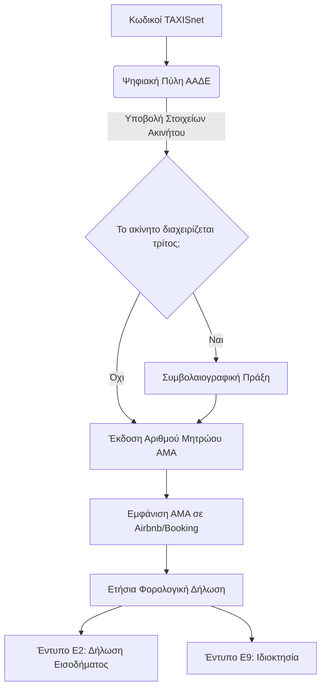

# Οι Κανόνες Βραχυχρόνιας Μίσθωσης Αυστηροποιούνται

Η Ελλάδα έχει μεταβεί από ένα χαλαρά ρυθμισμένο περιβάλλον βραχυχρόνιας μίσθωσης σε ένα ολοένα και πιο δομημένα ρυθμιζόμενο. Αν καταχωρείτε ακίνητο σε Airbnb, Booking.com ή οποιαδήποτε πλατφόρμα, η αγνόηση του νομικού πλαισίου δεν είναι πλέον μια «γκρίζα ζώνη» — είναι ένας κίνδυνος με πραγματικές, βαριές οικονομικές συνέπειες.

Ας δούμε πώς μοιάζει πραγματικά το ρυθμιστικό τοπίο το 2026, αφαιρώντας τη νομική ορολογία.

## Το Χωνί της Συμμόρφωσης

Για να λειτουργήσει νόμιμα μια βραχυχρόνια μίσθωση, ο ιδιοκτήτης πρέπει να περάσει από τρία ξεχωριστά ρυθμιστικά επίπεδα.

## Ο Αριθμός Μητρώου: Η Άδεια Λειτουργίας Σας

Όπως δείχνει το διάγραμμα, κάθε βραχυχρόνια μίσθωση στην Ελλάδα πρέπει να εγγραφεί στην **ΑΑΔΕ** και να της αποδοθεί ένας μοναδικός **Αριθμός Μητρώου Ακίνητης Περιουσίας (ΑΜΑ)**. Αυτός ο αριθμός πρέπει να εμφανίζεται σε κάθε αγγελία, σε κάθε πλατφόρμα, χωρίς απολύτως καμία εξαίρεση. Χωρίς ΑΜΑ, δεν υπάρχει νομιμότητα.

Η ίδια η διαδικασία είναι απλή μέσω της ψηφιακής πύλης, αλλά οι λεπτομέρειες μετράνε. Λάθη στο δηλωμένο εμβαδόν ή στη χωρητικότητα των επισκεπτών μπορούν να δημιουργήσουν σοβαρά προβλήματα κατά τους ελέγχους, και οι αλγόριθμοι διασταύρωσης στοιχείων έχουν γίνει πλέον εξαιρετικά επιθετικοί.

## Το Όριο των 60 Ημερών (Και Πώς Ενεργοποιούνται τα Πρόστιμα)

Αν είστε «μη επαγγελματίας» οικοδεσπότης (δηλαδή δεν έχετε κάνει έναρξη επιτηδεύματος/εταιρείας με δραστηριότητα συγκεκριμένα για τουρισμό), υπόκεισθε σε ένα αυστηρό **ετήσιο όριο 60 ημερών** σε συγκεκριμένους κορεσμένους δήμους (όπως κάποιες ζώνες στο κέντρο της Αθήνας και της Θεσσαλονίκης).

**Δείτε πώς ακριβώς λειτουργεί η "παγίδα" του ορίου των 60 ημερών:**
1. Τα συστήματα της ΑΑΔΕ συγχρονίζονται αυτόματα με την Airbnb, την Booking.com και τη Vrbo στο τέλος κάθε τριμήνου.
2. Οι αλγόριθμοι αθροίζουν τις συνολικές κρατημένες διανυκτερεύσεις σε *όλες* τις πλατφόρμες που ταιριάζουν με τον ΑΜΑ σας.
3. Αν το σύνολο ξεπεράσει τις 60 ημέρες στις 31 Δεκεμβρίου, το σύστημα βάζει αμέσως "κόκκινη σημαία" στον ΑΜΑ.
4. Λαμβάνετε αυτόματη ειδοποίηση μέσω ΑΑΔΕ που απαιτεί αναβάθμιση σε επαγγελματική επιχειρηματική ιδιότητα (έναρξη επαγγέλματος).
5. Αν δεν κάνετε αναδρομική αναβάθμιση και δεν πληρώσετε τους σχετικούς εμπορικούς φόρους εντός της προθεσμίας -  καλείστε να πληρώσετε πρόστιμα που ξεκινούν από €5.000.

Δεν μπορείτε να παρακάμψετε τον κανόνα μοιράζοντας τις κρατήσεις σε διαφορετικές πλατφόρμες. Τα δεδομένα συγκεντρώνονται σε επίπεδο ΑΦΜ.

## Πώς Φορολογείται το Εισόδημα

Τα έσοδα από βραχυχρόνια μίσθωση δηλώνονται ετησίως μέσω του **εντύπου Ε2** (Εισοδήματα από Ακίνητα). Οι φορολογικοί συντελεστές είναι προοδευτικοί: 15% στα πρώτα €10.000, 35% στα €10.001–€20.000 και 45% για οτιδήποτε πάνω από αυτό.

Η κρίσιμη διαφορά που χάνουν οι περισσότεροι ιδιοκτήτες είναι ότι **τα έσοδα βραχυχρόνιας μίσθωσης αντιμετωπίζονται ως επιχειρηματικό εισόδημα**. Αυτό σημαίνει ότι κόστη καθαρισμού, αμοιβές διαχείρισης, προμήθειες πλατφορμών, αναλώσιμα, και συντήρηση μπορούν να εκπέσουν ωε τεκμηριωμένα έξοδα.

## Το Δημοτικό Επίπεδο

Αυτό που αιφνιδιάζει πολλούς ιδιοκτήτες είναι ότι οι δήμοι μπορούν να επιβάλλουν τους δικούς τους κανόνες πάνω από το εθνικό πλαίσιο. Η Αθήνα έχει ήδη προχωρήσει σε πλαφόν νέων εγγραφών. Η Θεσσαλονίκη ετοιμάζει αντίστοιχα μέτρα για το κέντρο της (όπως αναλύσαμε στο [άρθρο μας για την επερχόμενη απαγόρευση δημιουργίας νέων ΑΜΑ](/el/journal/thessaloniki-registry-ban)).

## Τα Λάθη που Πραγματικά Οδηγούν σε Πρόστιμα

1. **Μη εμφάνιση του ΑΜΑ.** Οι πλατφόρμες αρχίζουν να το επιβάλλουν αυτόματα — η Airbnb ήδη "κατεβάζει" αγγελίες στην Ελλάδα χωρίς αριθμό μητρώου — αλλά πολλές παλιές αγγελίες παραμένουν εκτεθειμένες.
2. **Μη δήλωση εσόδων.** Η ΑΑΔΕ έχει συμφωνίες άμεσης ανταλλαγής δεδομένων. Γνωρίζουν πόσα κέρδισε το ακίνητό σας με ακρίβεια ευρώ. 
3. **Απουσία εξουσιοδότησης διαχείρισης.** Αν οποιοσδήποτε εκτός από τον εγγεγραμμένο ιδιοκτήτη διαχειρίζεται το ακίνητο, πρέπει να υπάρχει συμβολαιογραφική σύμβαση *πριν* κάνει check-in ο πρώτος επισκέπτης.
4. **Απουσία πυροσβεστικού εξοπλισμού.** Ένας πυροσβεστήρας και ανιχνευτές καπνού είναι υποχρεωτικοί. Ένας ανιχνευτής καπνού των €20 που λείπει, μπορεί να προκαλέσει πρόστιμο €500  σε έναν ξαφνικό έλεγχο.

## Πώς η Homevision Χειρίζεται Τη Συμμόρφωση

Στη Homevision, η συμμόρφωση είναι ο πυρήνας της λειτουργίας μας από την πρώτη ημέρα. Αναλαμβάνουμε την εγγραφή στην ΑΑΔΕ, διασφαλίζουμε ότι κάθε αγγελία έχει τον σωστό αριθμό μητρώου, προετοιμάζουμε τα έγγραφα αναφοράς εσόδων για τον λογιστή σας, ελέγχουμε όλα τα ακίνητα για πυρασφάλεια — και το σημαντικότερο — παρακολουθούμε στενά τις κανονιστικές αλλαγές ώστε να προστατεύουμε τα συμφέροντά σας.

> **Πρακτική συμβουλή:** Αν αποκτήσατε τον ΑΜΑ του ακινήτου σας πριν από χρόνια, ελέγξτε τον *σήμερα*. Η ΑΑΔΕ έχει ενημερώσει τις απαιτήσεις πολλές φορές από την πρεμιέρα του συστήματος. 

*Έχετε απορίες για τη νομική συμμόρφωση του ακινήτου σας; [Επικοινωνήστε μαζί μας](/el/contact) για έναν δωρεάν ρυθμιστικό έλεγχο — παίρνει μόνο 15 λεπτά και μπορεί να σας σώσει από χιλιάδες ευρώ προστίμων.*
