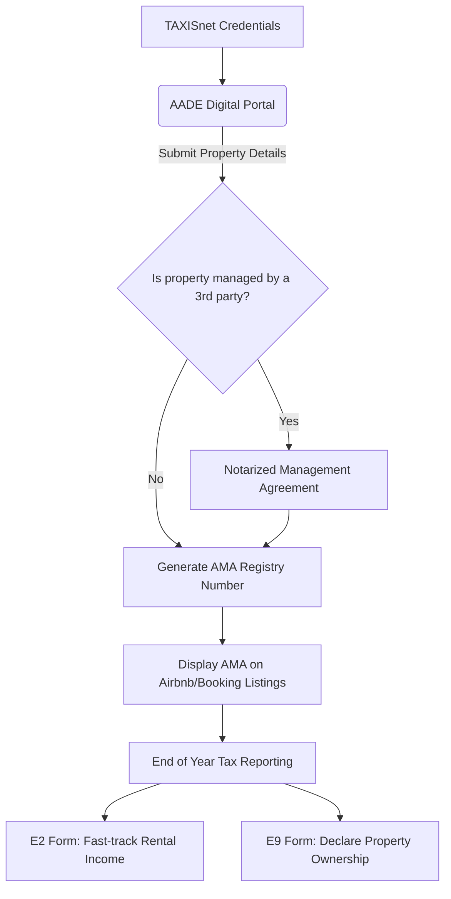

# Greece's Short-Term Rental Rules Are Tightening

Greece has moved from a loosely regulated short-term rental environment to an increasingly structured one. If you're listing a property on Airbnb, Booking.com, or any other platform, ignoring the legal framework isn't a grey area anymore — it's a risk with real financial consequences.

Here's what the regulatory landscape actually looks like in 2026, stripped of jargon and told in plain language.

## The Compliance Funnel

To legally operate a short-term rental, every owner must navigate three distinct regulatory layers. Failing at any step breaks the chain.

## The Registry Number: Your License to Operate

As the flowchart shows, every short-term rental in Greece must be registered with **AADE** (the Independent Authority for Public Revenue) to receive a unique **Property Registry Number** — the ΑΜΑ (Αριθμός Μητρώου Ακίνητης Περιουσίας). This number must appear on every listing, on every platform, without exception. No ΑΜΑ, no legal listing.

The process itself is straightforward through the AADE digital portal, but the details matter. Errors in declared square footage or guest capacity can create headaches during inspections, and cross-referencing algorithms have become increasingly aggressive.

## The 60-Day Annual Cap (And How Fines Are Triggered)

If you are a "non-professional" host (meaning you do not have a registered business entity or sole proprietorship specifically for tourism/hospitality), you are currently subject to a strict **60-day annual cap** in specific congested municipalities (like certain zones in central Athens and Thessaloniki).

**Here is exactly how the 60-day cap trap works:**
1. AADE's systems automatically sync with Airbnb, Booking.com, and Vrbo at the end of every quarter.
2. The algorithms aggregate the total nights booked across *all* platforms matching your AMA.
3. If the total exceeds 60 days on December 31st, the system flags the ΑΜΑ.
4. You receive an automated notification via the AADE portal demanding an upgrade to professional business status (έναρξη επαγγέλματος).
5. If you fail to retroactively upgrade and pay the associated commercial taxes within the compliance window, you face fines starting at €5,000.

You cannot bypass this by splitting listings across platforms; the data is aggregated at the tax-ID level.

## How Income Gets Taxed

Short-term rental income is declared annually through the **E2 form** (Real Estate Income), and the property itself must be separately declared in the **E9 form**. The tax rates for private individuals are progressive: 15% on the first €10,000, 35% on €10,001–€20,000, and 45% on anything above that.

Here's the critical difference most owners miss: **short-term rental income is treated as business income**. That means cleaning costs, management fees, platform commissions, supplies, maintenance — all of it can be deducted as documented expenses. Long-term rental income doesn't enjoy this advantage. For owners earning above €10,000 annually from rentals, the ability to deduct expenses often narrows the effective tax gap between the two models significantly.

## The Municipal Layer

What catches many owners off guard is that municipalities can layer their own rules on top of the national framework. Athens has already moved to cap new registrations in congested neighborhoods. Thessaloniki is preparing similar measures for its city center (we wrote about the specifics in [our article on the coming registry ban](/en/journal/thessaloniki-registry-ban)).

The inconsistency between municipalities is the part that frustrates most owners. The same property type, managed the same way, can be fully compliant in one postal code and in violation in another. Staying current requires either serious diligence or a manager who handles compliance as part of their service.

## The Mistakes That Actually Get People Fined

After working with dozens of property owners across Northern Greece, we've seen the same compliance failures come up repeatedly.

1. **Not displaying the ΑΜΑ number.** Platforms are beginning to enforce this automatically — Airbnb now flags listings in Greece that don't include a registry number — but many older listings still lack it.
2. **Not declaring income.** AADE has tight data-sharing agreements with major platforms. They know what your property earned down to the euro. Under-declaring is no longer a gamble; it's a certainty of getting caught.
3. **Missing management authorization.** If anyone other than the registered owner is managing the property — whether that's a family member, a friend, or a professional company — a notarized management agreement must exist *before* the first guest checks in. 
4. **No fire safety equipment.** A fire extinguisher and smoke detectors are mandatory in all listed short-term rental properties. A missing €20 smoke detector can trigger a €500 fine during a spot inspection.

## How Professional Managers Handle This

At Homevision, compliance is baked into day-one operations. We handle AADE registration, ensure every listing carries the correct registry number, prepare income reporting documentation for your accountant, audit all properties for fire safety and insurance requirements, and — critically — stay current on municipal regulatory changes so that our owners don't have to parse government gazettes over coffee.

> **One practical tip:** If you acquired your property's ΑΜΑ years ago, review it today. AADE has updated requirements multiple times since the system launched. An outdated or non-compliant registration can be revoked, and re-registering in a restricted zone may no longer be possible.

*Have questions about your property's compliance? [Contact us](/en/contact) for a free regulatory review — it takes 15 minutes and could save you thousands.*
