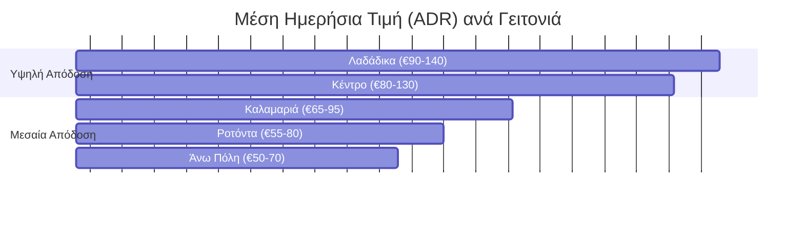

# Γιατί η Θεσσαλονίκη Είναι η πιο Υποτιμημένη Αγορά Μίσθωσης της Ελλάδας

Η Αθήνα παίρνει τα πρωτοσέλιδα. Τα νησιά παίρνουν τα posts στο Instagram. Αλλά η Θεσσαλονίκη χτίζει αθόρυβα μία από τις ισχυρότερες αγορές βραχυχρόνιας μίσθωσης στη χώρα, και οι περισσότεροι διεθνείς επενδυτές δεν το έχουν ακόμα παρατηρήσει.

Τα νούμερα λένε μια πειστική ιστορία. Ένα ποιοτικό 2υάρι στο κέντρο φτάνει τα €75–€120 τη βραδιά. Τα καλά διαχειριζόμενα ακίνητα πετυχαίνουν 65–75% ετήσια πληρότητα, ενώ τα αυτοδιαχειριζόμενα συνήθως κυμαίνονται στο 50-60%. Η υψηλή σεζόν εκτείνεται από Ιούνιο έως Σεπτέμβριο, αλλά σε αντίθεση με τα νησιά, η Θεσσαλονίκη ωφελείται από μια **ισχυρή ενδιάμεση σεζόν** που τροφοδοτείται από διεθνή συνέδρια, πολιτιστικές εκδηλώσεις, φεστιβάλ οινογνωσίας και τουρισμό city-break το Σαββατοκύριακο που επεκτείνει τη ουσιαστική ζήτηση μέσα στον Απρίλιο-Μάιο και τον Οκτώβριο-Νοέμβριο.

Αλλά το πραγματικό πλεονέκτημα δεν είναι το καλοκαίρι. Είναι αυτό που συμβαίνει τον υπόλοιπο χρόνο.

## Ο Χειμώνας που Δεν Πεθαίνει Ποτέ

Τα νησιωτικά ακίνητα μένουν κενά από Νοέμβριο έως Απρίλιο. Οι ιδιοκτήτες τους το δέχονται ως το κόστος της δραστηριοποίησης στον... παράδεισο. Οι ιδιοκτήτες στη Θεσσαλονίκη δεν αντιμετωπίζουν αυτό το πρόβλημα.

Η πόλη διατηρεί **40–50% πληρότητα ολόχρονα** από μια διαφοροποιημένη βάση ζήτησης που οι περισσότεροι τουριστικοί προορισμοί δεν μπορούν να ανταγωνιστούν: επαγγελματίες σε εμπορικές εκθέσεις και εταιρικές συναντήσεις, ακαδημαϊκοί ερευνητές στο Αριστοτέλειο Πανεπιστήμιο (ΑΠΘ), οικογένειες ασθενών στα μεγάλα νοσοκομεία, digital nomads που ελκύονται από το προσιτό κόστος ζωής και τις εξαιρετικές υποδομές διαδικτύου, και επισκέπτες Σαββατοκύριακου από πρωτεύουσες των Βαλκανίων λίγες ώρες μακριά με το αυτοκίνητο.

Αυτή η βασική χειμερινή πληρότητα μεταμορφώνει τα οικονομικά της ιδιοκτησίας ακινήτων. Ενώ ένα νησιωτικό ακίνητο παράγει όλο του το εισόδημα μέσα σε 4 μήνες και μένει αδρανές τους άλλους 8, ένα ακίνητο στη Θεσσαλονίκη αποδίδει και τους 12 μήνες — κάνοντας την ετήσια ροή μετρητών πιο ομαλή, πιο προβλέψιμη και τελικά υψηλότερη για συγκρίσιμα επίπεδα επένδυσης.

## Οδηγός Γειτονιών για Σοβαρούς Ιδιοκτήτες

Δεν αποδίδουν όλες οι τοποθεσίες στη Θεσσαλονίκη το ίδιο. Οι διαφορές είναι αρκετά σημαντικές ώστε η σωστή επιλογή γειτονιάς μπορεί να σημαίνει 30–40% περισσότερο ετήσιο έσοδο.

*Σημείωση: Οι τιμές (ADRs) αντιπροσωπεύουν καλοδιατηρημένα διαμερίσματα 1-2 υπνοδωματίων υπό επαγγελματική διαχείριση. Μη ανακαινισμένα ή κακώς προωθημένα ακίνητα πέφτουν εμφανώς κάτω από αυτές τις ζώνες.*

Ας αναλύσουμε ακριβώς γιατί υπάρχουν αυτές οι διακυμάνσεις και τι είδους επισκέπτης έλκεται από κάθε γειτονιά.

**Το Κέντρο** είναι η «καρδιά» της αγοράς. Κοντινή πεζή απόσταση σε Αριστοτέλους, τη Νέα Παραλία, τα Λαδάδικα και τα μεγάλα πολιτιστικά σημεία αναφοράς. Τα ακίνητα εδώ βλέπουν ADR €80–€130 και πληρότητα 70–80% — τα υψηλότερα στην πόλη. Ο ανταγωνισμός εδώ είναι και ο πιο σκληρός, και η ρυθμιστική πίεση αυξάνεται. Η κυβέρνηση ετοιμάζεται να περιορίσει τις νέες εγγραφές βραχυχρόνιας μίσθωσης σε αυτή τη ζώνη. Αν έχετε υφιστάμενη εγγραφή (ΑΜΑ) εδώ, προστατέψτε τη. Θα γίνει όλο και πιο πολύτιμη.

Τα **Λαδάδικα**, η περιοχή της νυχτερινής ζωής και εστίασης, επιβάλλει ένα premium — ADR €90–€140 — αλλά προσελκύει συγκεκριμένα δημογραφικά. Αυτοί που κλείνουν διαμονή εδώ θέλουν την πλήρη εμπειρία της ελληνικής νυχτερινής ζωής. Περιμένετε νεότερους ταξιδιώτες, μικρότερης διάρκειας διαμονές 2-3 ημερών, και πολύ πιο γρήγορο turnover. Αυτό το κάνει ιδανικό για studios όπου το κόστος καθαρισμού ανά διανυκτέρευση παραμένει διαχειρίσιμο.

Η **Καλαμαριά**, το οικιστικό προάστιο στα νοτιοανατολικά, παίζει ένα εντελώς διαφορετικό παιχνίδι. Το ADR πέφτει στα €65–€95, αλλά το ίδιο κάνουν και ο ανταγωνισμός και το κόστος λειτουργίας. Η περιοχή προσελκύει οικογένειες, μεγαλύτερες διαμονές και επισκέπτες που προτιμούν εμπράκτως την ησυχία. Για τους ιδιοκτήτες που θέλουν σταθερό εισόδημα με μικρότερο ρίσκο φθοράς, η Καλαμαριά είναι ένα όλο και πιο έξυπνο στοίχημα, αποδίδοντας έως 60% πληρότητα όλο το χρόνο.

Η **Άνω Πόλη** προσφέρει μια ατμόσφαιρα που καμία άλλη γειτονιά δεν μπορεί να φτάσει. Οθωμανική αρχιτεκτονική, πανοραμική θέα, στενά λιθόστρωτα δρομάκια. Χαμηλότερη πληρότητα (55–65%) αλλά μακράν η υψηλότερη ικανοποίηση επισκεπτών. Αν το ακίνητό σας έχει θέα από εκεί πάνω, πρακτικά αυτο-προωθείται.

**Κοντά στο Πανεπιστήμιο (Ροτόντα-Καμάρα)** είναι η πιο budget-friendly ζώνη με εκπληκτικά σταθερή ζήτηση. Ακαδημαϊκοί, οικογένειες φοιτητών την περίοδο των ορκωμοσιών, φοιτητές Erasmus... ADR €55–€80 με 70–80% πληρότητα ακόμα και το κρύο του χειμώνα.

## Το Φαινόμενο του Σαββατοκύριακου στη Χαλκιδική

Η εγγύτητα με τη Χαλκιδική δημιουργεί μια δυναμική μοναδική στην ελληνική αγορά. Τον Ιούλιο και τον Αύγουστο, ορισμένα ακίνητα της Θεσσαλονίκης βλέπουν πτώση τις νύχτες της Παρασκευής και του Σαββάτου, καθώς οι τουρίστες κατευθύνονται στις παραλίες. Αυτό, όμως, είναι απλώς η "αντίστροφη εικόνα" της Χαλκιδικής, όπου τα ακίνητα βλέπουν μηδενική ζήτηση από Δευτέρα έως Πέμπτη, και σχεδόν μηδενική ζήτηση μετά τον Σεπτέμβριο.

Οι πιο έξυπνοι επενδυτές με τους οποίους συνεργαζόμαστε το εκμεταλλεύονται ενεργά αυτό. Ένα διαμέρισμα στη Θεσσαλονίκη καλύπτει τους 8 μήνες "αστικής" ζήτησης, και ένα σπίτι στη Χαλκιδική τους 4 μήνες της "παραλίας". Ομαδοποιώντας αυτά τα χαρτοφυλάκια, οι επαγγελματίες διαχειριστές μπορούν να κάνουν cross-selling στους επισκέπτες: "Μείνετε στο loft μας στο Κέντρο Δευτέρα-Πέμπτη για τα ψώνια και την κουλτούρα, και μετά πάτε στη βίλα μας στην Κασσάνδρα για το Σαββατοκύριακο". Μαζί, παρέχουν αδιάλειπτο ετήσιο εισόδημα με ελάχιστα κενά.

## Τι Έρχεται Στη Συνέχεια

Τρεις τάσεις αναδιαμορφώνουν αυτή τη στιγμή το τοπίο:

**Η ζήτηση από τους Digital Nomads επιταχύνεται.** Η αναπτυσσόμενη tech σκηνή της πόλης, οι espressos των €2, το γρήγορο οπτικό internet και η εύκολη περιήγηση με τα πόδια έχουν κάνει τη Θεσσαλονίκη μαγνήτη για remote workers. Οι μηνιαίες διαμονές αποτελούν πλέον το 15–20% των κρατήσεων σε κεντρικά διαμερίσματα με ειδικούς χώρους εργασίας (γραφεία). Αυτή η ζήτηση είναι λιγότερο εποχική, υψηλότερου καθαρού περιθωρίου κέρδους και αυξάνεται σταθερά κάθε χρόνο.

**Νέα αεροπορικά δρομολόγια δημιουργούν νέες αγορές.** Το Αεροδρόμιο Μακεδονία έχει προσθέσει απευθείας συνδέσεις με Λονδίνο-Λούτον, Βερολίνο, Βαρσοβία και Τελ Αβίβ τα δύο τελευταία χρόνια. Κάθε νέο δρομολόγιο δημιουργεί μια μετρήσιμη, άμεση αύξηση της ζήτησης.

**Το μετρό τελικά αλλάζει την γεωγραφία της πόλης.** Τα ακίνητα κοντά σε σταθμούς μετρό ήδη τιμολογούν premium. Η αγορά ακινήτου κοντά σε έναν μελλοντικό σταθμό σήμερα είναι ένα στοίχημα με ασύμμετρο τεράστιο κέρδος στο άμεσο μέλλον.

> **Η άποψή μας:** Η αγορά της Θεσσαλονίκης ωριμάζει ταχέως αλλά προσφέρει ακόμα σημαντικά καλύτερους λόγους αξίας-απόδοσης από ό,τι η Αθήνα ή τα νησιά. Το παράθυρο ευκαιρίας για την είσοδο σε ακόμα ελκυστικές τιμές απόκτησης, ωστόσο, στενεύει.

*Θέλετε να κατανοήσετε τι μπορεί να βγάλει το δικό σας ακίνητο με βάση τα ιστορικά μας δεδομένα; [Επικοινωνήστε μαζί μας](/el/contact) για μια εξατομικευμένη ανάλυση αγοράς της γειτονιάς σας.*
