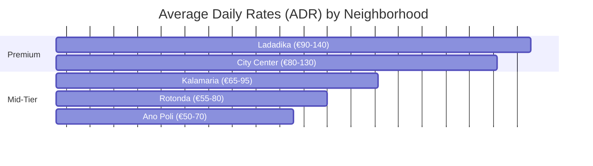

# Why Thessaloniki Is Greece's Most Underrated Rental Market

Athens gets the headlines. The islands get the Instagram posts. But Thessaloniki — Greece's second city — has been quietly building one of the country's strongest short-term rental markets, and most international investors still haven't noticed.

The numbers tell a compelling story. A quality 2-bedroom apartment in the center commands €75–€120 per night. Well-managed properties achieve 65–75% annual occupancy, while self-managed ones typically land at 50–60%. Peak season runs June through September, but unlike island properties, Thessaloniki benefits from a **strong shoulder season** driven by international conferences, cultural events, wine festivals, and weekend city-break tourism that extends meaningful demand into April-May and October-November.

But the real advantage isn't the summer. It's what happens the rest of the year.

## The Winter That Doesn't Die

Island properties sit empty from November to April. Their owners accept this as the cost of doing business in paradise. Thessaloniki property owners don't have that problem.

The city maintains **40–50% occupancy year-round** from a diversified demand base that most resort destinations can't match: business travelers attending trade fairs and corporate meetings, visiting academics and researchers at Aristotle University, families visiting patients at the city's major hospitals, digital nomads attracted by affordable cost of living and excellent internet infrastructure, and weekend city-breakers from Balkans capitals just a few hours away by car.

This baseline winter occupancy transforms the economics of property ownership. Where an island property might generate all its income in 4 months and sit idle for 8, a Thessaloniki property produces revenue across all 12 — making the annual cash flow smoother, more predictable, and ultimately higher for comparable investment levels.

## A Neighborhood Guide for Serious Owners

Not all locations within Thessaloniki perform equally. The differences are significant enough that the right neighborhood choice can mean 30–40% more annual revenue.

*Note: ADRs represent well-maintained, professionally managed 1-to-2 bedroom apartments. Unrenovated or poorly distributed properties fall significantly below these bands.*

Let's break down exactly why these bands exist and what kind of guest each neighborhood attracts.

**City Center (Kentro)** is the beating heart of the market. Walking distance to Aristotelous Square, the waterfront, Ladadika, and the major cultural sites. Properties here see ADR of €80–€130 and occupancy rates of 70–80% — the highest in the city. The competition is also strongest here, and regulatory pressure is mounting. The government is preparing to restrict new short-term rental registrations in this zone. If you have an existing registration here, protect it. It will become increasingly valuable.

**Ladadika**, the nightlife and dining district, commands a premium — ADR of €90–€140 — but attracts a specific demographic. Guests who book here want the full Greek nightlife experience. Expect younger travelers, shorter stays of 2–3 nights, and higher turnover. This makes it ideal for studios and one-bedroom properties where cleaning costs per night stay manageable.

**Kalamaria**, the residential suburb southeast of the center, plays a different game entirely. ADR drops to €65–€95, but so does competition and cost of operations. The area attracts families, longer stays, and visitors who actively prefer quiet over nightlife. For owners who want steady, lower-maintenance income without the intensity of center-city operations, Kalamaria is an increasingly smart bet, yielding up to 60% occupancy year-round.

**Ano Poli (Upper Town)** offers an atmosphere that no other neighborhood can match. Ottoman-era architecture, panoramic views of the Thermaic Gulf, narrow cobblestone streets. Properties here attract a very specific guest — cultural tourists, photographers, couples celebrating anniversaries. Occupancy is lower (55–65%), but guest satisfaction scores tend to be the highest in the city. If your property has a view, it practically markets itself.

**Near the University (Rotonda area)** is the budget-friendly zone with surprisingly consistent demand. Visiting academics, students' families during graduation season, and Erasmus students needing short-term accommodation drive reliable bookings at €55–€80 per night, with occupancy reaching 70–80% even in winter months.

## The Chalkidiki Weekend Effect

Thessaloniki's proximity to Chalkidiki — 45 minutes to Kassandra, 90 minutes to Sithonia — creates a dynamic that's unique in the Greek market. During July and August, some Thessaloniki properties see a dip on Friday and Saturday nights as tourists head to the beaches. But this is the mirror image of Chalkidiki, where properties see zero demand from Monday to Thursday, and zero annual demand outside the summer window.

The smartest owners we work with actively lean into this. A Thessaloniki apartment covers the 8 months of city demand, while a Chalkidiki house covers the 4 months of intense beach season. By grouping these portfolios, professional managers can cross-sell guests: "Stay in our city loft Monday-Thursday for the shopping and culture, then head to our Kassandra villa for the weekend." Together, they provide near year-round, un-interrupted income with minimal gaps.

## What's Coming Next

Three trends are reshaping Thessaloniki's rental landscape right now.

**Digital nomad demand is accelerating.** The city's growing tech scene, €2 espressos, fast fiber internet, and walkability have made it a magnet for remote workers. Monthly stays from digital nomads now account for 15–20% of bookings in centrally located apartments with dedicated workspaces. This demand is less seasonal, higher margin (lower turnover costs), and growing year over year.

**New flight routes are creating new markets.** Thessaloniki Airport has added direct connections to London Luton, Berlin, Warsaw, and Tel Aviv in the past two years. Each new route creates a measurable, immediate bump in bookings from that origin market — and the upcoming airport terminal expansions promise even more.

**The metro is finally changing geography.** Thessaloniki's metro system is transforming accessibility across the city. Properties near active metro stations are already pricing at a 10-15% premium. For investors, buying near a future metro stop (like the Kalamaria extension) today is a bet with asymmetric upside.

> **Our view:** Thessaloniki's market is maturing rapidly but still offers meaningfully better value-to-yield ratios than Athens or the islands. The window for entering at attractive acquisition prices is narrowing — especially in the city center, where new short-term rental registrations face increasing restrictions.

*Want to understand what your specific Thessaloniki property could earn based on our historical data? Download our Neighborhood Yield Report or [contact us](/en/contact) for a personalized market analysis.*
