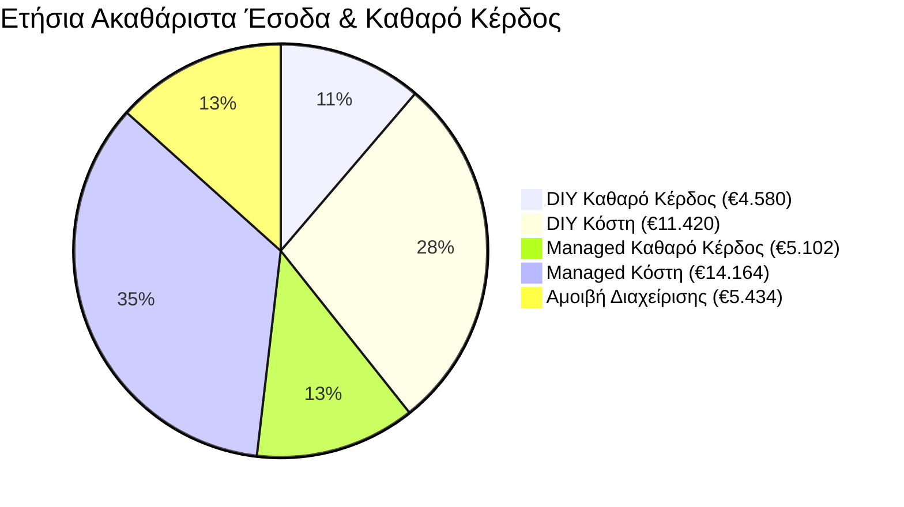

# Ο Υπολογισμός που Κάνουν Λάθος οι Ιδιοκτήτες

Η λογική που ακούμε πιο συχνά: «Ένας διαχειριστής παίρνει 20–25% των εσόδων μου. Μπορώ να τα κάνω όλα μόνος και να κρατήσω το 100%.»

Είναι λογικό. Αλλά λάθος — γιατί προϋποθέτει ότι θα δημιουργούσατε τα ίδια έσοδα μόνοι σας. Στην πράξη, η διαφορά μεταξύ αυτοδιαχειριζόμενων και επαγγελματικά διαχειριζόμενων ακινήτων είναι αρκετά σημαντική ώστε το τέλος διαχείρισης να αποπληρώνεται μόνο του.

Ας τρέξουμε τα νούμερα σε πραγματικό σενάριο.

## Το Σενάριο Αυτοδιαχείρισης

Πάρτε ένα τυπικό 2υάρι στο κέντρο της Θεσσαλονίκης, 4 ατόμων. Η ιδιοκτήτρια είναι οργανωμένη, ανταποκρίνεται γρήγορα, προσπαθεί γνήσια. Βάζει ανταγωνιστική τιμή €80/βράδυ, πετυχαίνει **200 κρατημένα βράδια τον χρόνο** (περίπου 55% πληρότητα — πολύ καλά για αυτοδιαχείριση), και χειρίζεται μόνη της τον καθαρισμό, την επικοινωνία, τα check-ins, τις κλήσεις εκτάκτου ανάγκης και τη βελτιστοποίηση των αγγελιών.

Τα ετήσια ακαθάριστα έσοδά της φτάνουν τα €16.000. Αξιοπρεπές για δευτερεύουσα δραστηριότητα. Αλλά τα κόστη τρώνε τα κέρδη γρήγορα. Ο καθαρισμός (150 αλλαγές) κοστίζει γύρω στα €7.500. Τα αναλώσιμα προσθέτουν €1.200. Οι προμήθειες των πλατφορμών (περίπου 12% σε Airbnb και Booking.com) αφαιρούν €1.920. Οι μικροεπισκευές και η συντήρηση κοστίζουν άλλα €800. **Σύνολο εξόδων: περίπου €11.420.**

**Καθαρό εισόδημα: €4.580.** Συν περίπου 600 ώρες από τον χρόνο της κατά τη διάρκεια του έτους — το ισοδύναμο μιας ουσιαστικής δουλειάς ημιαπασχόλησης.

## Το Σενάριο Επαγγελματικής Διαχείρισης

Το ίδιο διαμέρισμα. Στην ίδια γειτονιά. Αλλά τώρα υπό τη διαχείριση της Homevision.

Ο αλγόριθμος δυναμικής τιμολόγησης προσαρμόζει τις τιμές καθημερινά με βάση την τοπική ζήτηση, τις τιμές του ανταγωνισμού, τις εκδηλώσεις και την εποχικότητα. Οι τιμές κυμαίνονται από €55 τις ήσυχες καθημερινές μέχρι €160 τα Σαββατοκύριακα εκδηλώσεων ή την κορύφωση του Αυγούστου. Η μέση τιμή ανά βράδυ στο έτος σταθεροποιείται γύρω στα **€95** — όχι μέσω αισιοδοξίας, αλλά μέσω συστηματικής βελτιστοποίησης που ένας άνθρωπος απλά δεν μπορεί να αναπαραγάγει χειροκίνητα.

Η πληρότητα φτάνει το **70–75%** — 260 βράδια τον χρόνο — και αυτό οφείλεται στους ταχύτερους χρόνους απόκρισης (ο αλγόριθμος της Airbnb ανταμείβει τους hosts που απαντούν σε λεπτά), στην επαγγελματική φωτογράφιση, στο βελτιστοποιημένο κείμενο της καταχώρησης και στην ταυτόχρονη προβολή σε πολλαπλές πλατφόρμες (Airbnb, Booking.com, Vrbo, και direct booking).

Ετήσια ακαθάριστα έσοδα: **€24.700.**

Η δομή των εξόδων είναι φυσικά μεγαλύτερη. Καθαρισμός για 180 αλλαγές: €9.000. Αναλώσιμα: €1.400. Προμήθειες πλατφορμών: €2.964. Συντήρηση: €800. Το τέλος διαχείρισης στο 22% επί του τζίρου: €5.434. **Σύνολο εξόδων: περίπου €19.598.**

**Καθαρό εισόδημα: €5.102.** Και απολύτως μηδέν ώρες χρόνου από τον ιδιοκτήτη.

## Η Οπτικοποίηση της Διαφοράς

*Σημείωση: Ενώ το μερίδιο συνολικών εξόδων στη επαγγελματική διαχείριση είναι συνολικά μεγαλύτερο, το Καθαρό Κέρδος που καταλήγει στην τσέπη του ιδιοκτήτη αυξάνεται στην πραγματικότητα κατά ~11%, ενώ ο προσωπικός του χρόνος διαχείρισης μειώνεται κατά 100%.*

## Case Study Πραγματικού Κόσμου: Δυάρι στην Τούμπα

Για να ξεφύγουμε από τα θεωρητικά, ας δούμε ένα ανώνυμο ακίνητο που αναλάβαμε στα τέλη του 2024. Πρόκειται για ένα κλασικό δυάρι (δύο υπνοδωματίων) στην Κάτω Τούμπα.

**Πριν την Homevision (2024 - Αυτοδιαχείριση):**
Ο ιδιοκτήτης το διαχειριζόταν αποκλειστικά μέσω Airbnb. Διατηρούσε στατική τιμή €65 όλο τον χρόνο. Πέτυχε 182 κρατημένα βράδια, βγάζοντας **€11.830 μεικτά**. Αφού πλήρωσε τις καθαρίστριες από την τσέπη του και κάλυψε τις προμήθειες, το καθαρό του κέρδος ήταν περίπου €3.200. Επίσης, ξόδευε σχεδόν κάθε Κυριακή του οργανώνοντας τα check-ins.

**Μετά την Homevision (2025 - Επαγγελματική Διαχείριση):**
Μοιράσαμε την καταχώρηση σε 5 πλατφόρμες. Εφαρμόσαμε δυναμική τιμολόγηση, «πιάνοντας» την τεράστια αύξηση της ζήτησης κατά την περίοδο της ΔΕΘ με χρέωση €140/βράδυ, και ρίχνοντας τις τιμές στα €45 στα τέλη Νοεμβρίου για να εξασφαλίσουμε 85% πληρότητα κατά τον πιο ήσυχο μήνα. Το ακίνητο έπιασε 275 κρατημένα βράδια, αποφέροντας **€20.625 μεικτά**.

Ακόμη και μετά την προμήθειά μας 20%, το καθαρό εισόδημα του ιδιοκτήτη ανέβηκε στα €4.600 — **μια αύξηση καθαρού κέρδους 43%**, ενώ του δώσαμε πίσω και τις Κυριακές του.

## Πού Δημιουργείται το Κενό στα Έσοδα

Τρεις καθοριστικοί παράγοντες οδηγούν σε αυτή τη διαφορά, και ο καθένας ενισχύει τον άλλον:

1. **Η δυναμική τιμολόγηση προσθέτει 15–30% στα έσοδα.** Ένας άνθρωπος μπορεί να ελέγξει ανταγωνιστικές τιμές μία φορά την εβδομάδα. Ένας αλγόριθμος προσαρμόζεται κάθε μέρα.
2. **Οι ταχύτερες απαντήσεις αυξάνουν τη μετατροπή κρατήσεων.** Όταν ένας επισκέπτης στέλνει ερώτημα στις 11 το βράδυ, μια εταιρεία με 24/7 κάλυψη απαντά σε λεπτά. Ένας μόνος host μπορεί να απαντήσει το πρωί — μέχρι τότε ο επισκέπτης έχει κλείσει αλλού.
3. **Η πολυκαναλική διανομή συλλαμβάνει ζήτηση** που δεν αγγίζει ποτέ το Airbnb. 

## Πότε Βγάζει Όντως Νόημα η Αυτοδιαχείριση;

Ειλικρίνεια πάνω απ' όλα: η επαγγελματική διαχείριση δεν είναι για όλους. Μια εταιρεία διαχείρισης ακινήτων μπορεί να *μην* είναι η σωστή επιλογή για εσάς αν:
* Απλά νοικιάζετε ένα κενό δωμάτιο στο σπίτι που μένετε ήδη οι ίδιοι.
* Έχετε εξαιρετικό πάθος για τη φιλοξενία, απολαμβάνετε να υποδέχεστε προσωπικά τους επισκέπτες σας και θεωρείτε το hosting ως το κύριο full-time χόμπι σας.
* Νοικιάζετε το εξοχικό σας μόνο για 3-4 εβδομάδες τον χρόνο, τις μέρες που λείπετε.

> **Το βασικό συμπέρασμα:** Η επαγγελματική διαχείριση δεν σας κοστίζει χρήματα — κοστίζει ένα ποσοστό εσόδων που πιθανότατα δεν θα είχατε δημιουργήσει μόνοι σας. Παίρνετε πίσω τον χρόνο σας, και το ακίνητό σας τρέχει σαν αληθινή επιχείρηση.

*Θέλετε να τρέξουμε τα νούμερα για τον δικό σας δρόμο; Κατεβάστε το Report Αποδόσεων Θεσσαλονίκης ή [κλείστε μια κλήση μαζί μας](/el/contact) για να αναλύσουμε τα πραγματικά δεδομένα της γειτονιάς σας.*
