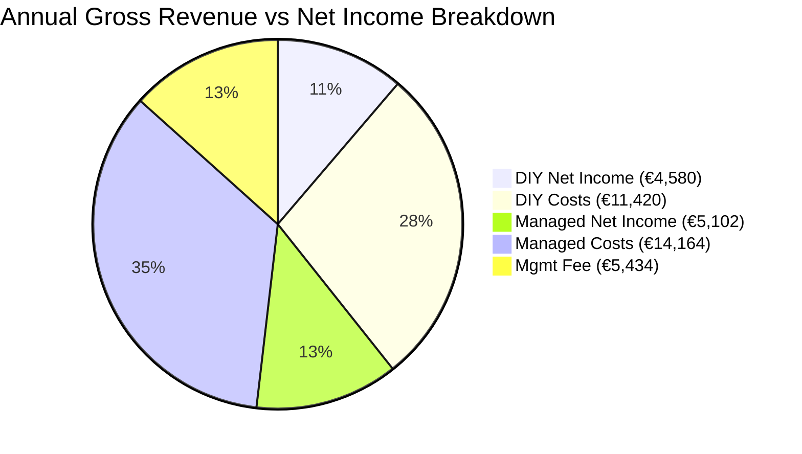

# The Calculation Most Property Owners Get Wrong

Here's the mental model most owners use when they hear about professional property management: "A manager takes 20–25% of my revenue. I can do everything myself and keep 100%."

It's logical. It's also wrong — because it assumes you'd generate the same revenue on your own. In practice, the gap between self-managed and professionally managed properties is significant enough that the management fee often pays for itself. And then some.

Let's run the numbers on a real scenario.

## The DIY Scenario

Take a typical 2-bedroom apartment in central Thessaloniki, sleeping four guests. The owner is organized, responsive, and genuinely tries. She sets a competitive nightly rate of €80, manages to fill **200 nights per year** (about 55% occupancy — solid for a self-manager), and handles cleaning coordination, guest communication, check-ins, emergency calls, and listing optimization herself.

Her annual gross revenue comes to €16,000. Not bad for a side operation. But the costs eat into it quickly. Cleaning at 150 turnovers per year runs about €7,500. Supplies and consumables add €1,200. Platform commissions (averaging 12% across Airbnb and Booking.com) take €1,920. Minor repairs and maintenance cost another €800. **Total costs: roughly €11,420.**

**Net income: €4,580.** Plus approximately 600 hours of her time over the year — the equivalent of a substantial part-time job. At even €10 per hour, that's €6,000 in opportunity cost that doesn't appear on any spreadsheet but is very real.

## The Professionally Managed Scenario

Same apartment. Same neighborhood. Now managed by a company like Homevision.

The dynamic pricing algorithm adjusts rates daily based on local demand, competitor pricing, events, and seasonality. Rates fluctuate between €55 on slow midweek nights and €160 during festival weekends or peak August. The average nightly rate across the year settles at about **€95** — not through optimism, but through systematic optimization that a human simply cannot replicate manually.

Occupancy reaches **70–75%** — 260 nights per year — driven by faster response times (Airbnb's algorithm rewards hosts who reply within minutes), professional photography, optimized listing copy, and multi-platform distribution across Airbnb, Booking.com, Vrbo, and direct booking channels.

Annual gross revenue: **€24,700.**

The cost structure is heavier. Cleaning at 180 turnovers: €9,000. Supplies: €1,400. Platform commissions: €2,964. Maintenance: €800. The management fee at 22% of gross: €5,434. **Total costs: roughly €19,598.**

**Net income: €5,102.** And zero hours of the owner's time.

## Visualizing the Difference

*Note: While the Managed costs slice is larger overall, the Net Income retained by the owner actually grows by ~11%, while their time invested drops by 100%.*

## Real-World Case Study: The Toumba 2-Bedroom

To move beyond hypotheticals, let's look at an anonymized property we took over in late 2024. The property is a standard two-bedroom apartment in Kato Toumba.

**Before Homevision (2024 - DIY):**
The owner managed it on Airbnb exclusively. They kept rates static at €65 year-round. They achieved 182 booked nights, generating **€11,830 gross**. After paying cleaners entirely out of pocket and covering platform fees, their net was around €3,200. They also spent nearly every Sunday coordinating check-ins.

**After Homevision (2025 - Managed):**
We distributed the listing across 5 channels. We implemented dynamic pricing, catching the massive demand spikes during the Thessaloniki International Fair (ΔΕΘ) charging €140/night, and dropping rates to €45 in late November to ensure 85% occupancy during the quietest month. The property hit 275 booked nights, generating **€20,625 gross**. 

Even after our 20% management fee, the owner's net income jumped to €4,600 — a **43% increase in real profit**, while giving them their Sundays back.

## Where the Revenue Gap Comes From

Three factors drive this difference, and they compound on each other.

1. **Dynamic pricing adds 15–30% to revenue.** A human can check competitor rates once a week. An algorithm adjusts every day based on demand signals, local events, and booking patterns. The difference compounds across hundreds of nights.
2. **Faster response times increase booking conversion.** When a guest sends an inquiry at 11pm, a management team with 24/7 coverage responds in minutes. A solo host might respond in the morning — by which time the guest has booked elsewhere. Airbnb's own data shows that response time is one of the strongest predictors of conversion rate.
3. **Multi-platform distribution captures demand** that never touches Airbnb. Most self-managers list on one platform. Professionals distribute across four or five, with synchronized calendars, and capture booking traffic from travelers who prefer Booking.com, Google Travel, or direct booking sites.

## When Does DIY Actually Make Sense?

Honesty over hype: professional management isn't for everyone. A property management company might *not* be the right fit if:
* You are only renting out a spare room in the house you currently live in.
* You are exceptionally passionate about hospitality, enjoy greeting guests personally, and treat hosting as your primary full-time hobby.
* You only rent out your summer home for 3-4 weeks a year while you are away.

In these specific scenarios, the margin gap shrinks, and the personal touch you provide might outweigh algorithmic scaling.

> **The bottom line:** Professional management doesn't cost you money — it costs you a percentage of revenue you likely wouldn't have generated yourself. The net result is equal or greater income, zero time invested, and a rental that runs like a business, not a side hustle that slowly consumes your weekends.

*Want to run the math on your specific street? Download our Thessaloniki Neighborhood Yield Report or [book a call with our team](/en/contact) to run your numbers with true local data.*
